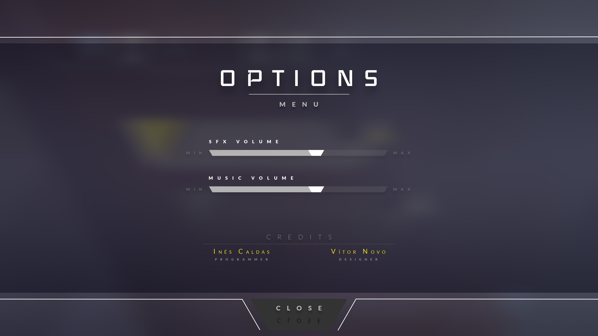

# Voyager [ongoing]
An "Asteroids" inspired game made with Unity

## Game Mechanics

### The player controls the spaceship and can:
- [x] Thrust onward/backwards
- [x] Turn left/right
- [x] Dash in the four directions (consumes energy)
- [x] Hyperjump (consumes energy)
- [x] Shoot (consumes energy)
- [x] Pick up collectables

### Collectables
- [x] Shield - makes the player invulnerable for some period of time
- [x] Life - the player regains a life, if not full. If full, gains points.
- [x] Energy - the player's energy is restored

### Asteroids
- [x] Rock - the player loses one life if he hits the asteroid
- [x] Ice - same as the Rock asteroid, but explodes when destroid. If the player is inside the area of effect, he loses one life
- [ ] Metal - same as the Rock, but consumes the player's energy while the player it's inside the area of effect

### Alien 
- [ ] Follows the player and shoots at him
- [ ] Improved aim, as the game progresses.

### Other TODO List
- [ ] Highscores
- [ ] UI and particle effects
- [ ] Game progression

## Game Assets
### Spaceship

### Asteroids

### Screen Designs

__Authors__
__Team Paranoid of Fox__
* [Inês Caldas](https://github.com/inessousacaldas) (Programmer)
* [Vítor Novo](https://www.artstation.com/vitornovo) (2D/3D Designer and Animator)
